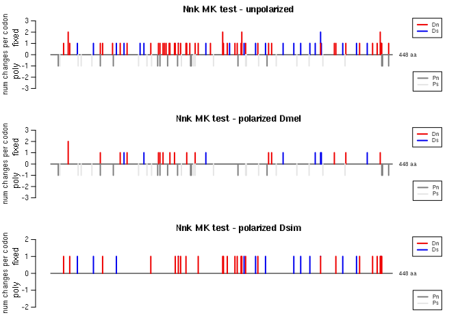

example_script_MKtest.Rmd
================
Janet Young

2025-01-13

# Load Janet’s MK functions

Also loads the Biostrings package.

``` r
source(here("scripts/MKfunctions.R"))
```

# Read in alignment, figure out sequence groupings

Read in alignment file, and fix the seqnames to remove descriptions.

This is an example alignment file I obtained from the MKT website. It
contains four sequences of the ASIP gene: two seqs from Pongo pygmaeus
(orangutan) and two from Trachypithecus cristatus (silvery lutung, an
Old World monkey).

``` r
alnFile <- here("test_data/MKTwebsiteExample/MKTwebsite_testAln.fa")
aln <- readBStringSet(alnFile)
aln
```

    ## BStringSet object of length 4:
    ##     width seq                                               names               
    ## [1]   399 ATGGATGTCACCCGCCTACTCCT...GCGTGCTCAGCCTCAACTGCTGA pongo1 gi|9099119...
    ## [2]   399 ATGGATGTCACCCGCCTACTCCT...GCGTGCTCAGCCTCAACTGCTGA pongo2 gi|1195676...
    ## [3]   399 ATGGATGTCACCCGCCTACTCCT...GCGTGCTCAGCCTCAACTGCTGA trachy1 gi|909912...
    ## [4]   399 ATGGATGTCACCCGCCTACTCCT...GCGTGCTCAGCCTCAACTGTTGA trachy2 gi|119567...

At first when we read in the alignment, sequence names also contain a
description (“gi\|909919…”): those are messy so I strip them off:

``` r
names(aln) <- sapply( strsplit(names(aln), " "), "[[", 1)
aln
```

    ## BStringSet object of length 4:
    ##     width seq                                               names               
    ## [1]   399 ATGGATGTCACCCGCCTACTCCT...GCGTGCTCAGCCTCAACTGCTGA pongo1
    ## [2]   399 ATGGATGTCACCCGCCTACTCCT...GCGTGCTCAGCCTCAACTGCTGA pongo2
    ## [3]   399 ATGGATGTCACCCGCCTACTCCT...GCGTGCTCAGCCTCAACTGCTGA trachy1
    ## [4]   399 ATGGATGTCACCCGCCTACTCCT...GCGTGCTCAGCCTCAACTGTTGA trachy2

Figure out the names of sequences from each population. This step will
be different for your alignment.

``` r
pongo_names <- grep("pongo", names(aln), value=TRUE)
pongo_names
```

    ## [1] "pongo1" "pongo2"

``` r
trachy_names <- grep("trachy", names(aln), value=TRUE)
trachy_names
```

    ## [1] "trachy1" "trachy2"

## Do the MK test

Do the MK test - simplest example:

``` r
MKresults_websiteExample <- doMKtest(
    myAlnFile=alnFile, 
    pop1seqs=pongo_names, 
    pop2seqs=trachy_names)
```

    ## 
    ## ##### reading alignment from file /Volumes/malik_h/user/jayoung/MKtest/MKtests_JY/test_data/MKTwebsiteExample/MKTwebsite_testAln.fa 
    ##     splitting alignment into groups and tabulating nucleotides

    ## Warning in doMKtest(myAlnFile = alnFile, pop1seqs = pongo_names, pop2seqs = trachy_names): this alignment has a codon at the end with only stop codons - we will strip it out and not count any changes in this codon

    ##     looking at allele frequencies
    ##     inferring ancestors
    ##     starting output table
    ##     categorizing population 1 vs 2 fixed changes
    ##     categorizing polymorphisms
    ##     doing MK tests
    ##         seqs_not_used

The output of the doMKtest function (here, stored in the
`MKresults_websiteExample` object) is a list, comprising two tables:  
- list element 1 (“summary”) contains the MK test results.  
- list element 2 (“positions”) contains a per-position analysis of the
alignment, wihch helps understand what’s going on with the alignment,
and/or with troubleshooting.

Here’s the `summary` table, transposed to a single column for easier
viewing. The results are at the bottom, with a record of the input
dataset and parameters used at the top.

``` r
MKresults_websiteExample[["summary"]] %>% 
    t() %>% 
    kable() %>% 
    kable_styling()
```

<table class="table" style="margin-left: auto; margin-right: auto;">
<thead>
<tr>
<th style="text-align:left;">
</th>
<th style="text-align:left;">
pop1_vs_pop2_Dn
</th>
</tr>
</thead>
<tbody>
<tr>
<td style="text-align:left;">
input
</td>
<td style="text-align:left;">
/Volumes/malik_h/user/jayoung/MKtest/MKtests_JY/test_data/MKTwebsiteExample/MKTwebsite_testAln.fa
</td>
</tr>
<tr>
<td style="text-align:left;">
num_seqs
</td>
<td style="text-align:left;">
4
</td>
</tr>
<tr>
<td style="text-align:left;">
num_seqs_pop1
</td>
<td style="text-align:left;">
2
</td>
</tr>
<tr>
<td style="text-align:left;">
num_seqs_pop2
</td>
<td style="text-align:left;">
2
</td>
</tr>
<tr>
<td style="text-align:left;">
num_seqs_outgroup
</td>
<td style="text-align:left;">
0
</td>
</tr>
<tr>
<td style="text-align:left;">
seqs_not_used
</td>
<td style="text-align:left;">
</td>
</tr>
<tr>
<td style="text-align:left;">
length_NT
</td>
<td style="text-align:left;">
396
</td>
</tr>
<tr>
<td style="text-align:left;">
length_AA
</td>
<td style="text-align:left;">
132
</td>
</tr>
<tr>
<td style="text-align:left;">
region_start_coord_codons
</td>
<td style="text-align:left;">
1
</td>
</tr>
<tr>
<td style="text-align:left;">
region_end_coord_codons
</td>
<td style="text-align:left;">
132
</td>
</tr>
<tr>
<td style="text-align:left;">
filter_rare_alleles
</td>
<td style="text-align:left;">
FALSE
</td>
</tr>
<tr>
<td style="text-align:left;">
rare_allele_freq_threshold
</td>
<td style="text-align:left;">
0
</td>
</tr>
<tr>
<td style="text-align:left;">
parameter_combining_approach
</td>
<td style="text-align:left;">
conservative
</td>
</tr>
<tr>
<td style="text-align:left;">
first_pop1_seq
</td>
<td style="text-align:left;">
pongo1
</td>
</tr>
<tr>
<td style="text-align:left;">
first_pop2_seq
</td>
<td style="text-align:left;">
trachy1
</td>
</tr>
<tr>
<td style="text-align:left;">
pop1_vs_pop2_chiSq_pVal
</td>
<td style="text-align:left;">
0.1184649
</td>
</tr>
<tr>
<td style="text-align:left;">
pop1_vs_pop2_FET_pVal
</td>
<td style="text-align:left;">
0.2307692
</td>
</tr>
<tr>
<td style="text-align:left;">
pop1_vs_pop2_Dn
</td>
<td style="text-align:left;">
5
</td>
</tr>
<tr>
<td style="text-align:left;">
pop1_vs_pop2_Ds
</td>
<td style="text-align:left;">
5
</td>
</tr>
<tr>
<td style="text-align:left;">
pop1_vs_pop2_Pn
</td>
<td style="text-align:left;">
0
</td>
</tr>
<tr>
<td style="text-align:left;">
pop1_vs_pop2_Ps
</td>
<td style="text-align:left;">
3
</td>
</tr>
<tr>
<td style="text-align:left;">
pop1_vs_pop2_NI
</td>
<td style="text-align:left;">
0
</td>
</tr>
<tr>
<td style="text-align:left;">
pop1_vs_pop2_alpha
</td>
<td style="text-align:left;">
1
</td>
</tr>
<tr>
<td style="text-align:left;">
pop1_vs_pop2_result
</td>
<td style="text-align:left;">
not signif
</td>
</tr>
</tbody>
</table>

For p-values, to test for departures from neutrality, some people choose
a chi-squared test (e.g. the MKT website), other people prefer a Fishers
exact test (“FET”). My script gives both p-values, so the user can
choose which to report. I think FET is more conservative.

I also wrote a little function called `showContingencyTable` to pull out
just the 2x2 contingency table showing counts from that summary table.
Here’s that table in the format used by the MKT website people:

``` r
showContingencyTable(MKresults_websiteExample[["summary"]]) %>% 
    kable() %>% 
    kable_styling()
```

<table class="table" style="margin-left: auto; margin-right: auto;">
<thead>
<tr>
<th style="text-align:left;">
</th>
<th style="text-align:right;">
polymorphic
</th>
<th style="text-align:right;">
fixed
</th>
</tr>
</thead>
<tbody>
<tr>
<td style="text-align:left;">
synonymous
</td>
<td style="text-align:right;">
3
</td>
<td style="text-align:right;">
5
</td>
</tr>
<tr>
<td style="text-align:left;">
non-synonymous
</td>
<td style="text-align:right;">
0
</td>
<td style="text-align:right;">
5
</td>
</tr>
</tbody>
</table>

And here it is transposed (I prefer this:)

``` r
showContingencyTable(MKresults_websiteExample[["summary"]]) %>% 
    t() %>% 
    kable() %>% 
    kable_styling()
```

<table class="table" style="margin-left: auto; margin-right: auto;">
<thead>
<tr>
<th style="text-align:left;">
</th>
<th style="text-align:right;">
synonymous
</th>
<th style="text-align:right;">
non-synonymous
</th>
</tr>
</thead>
<tbody>
<tr>
<td style="text-align:left;">
polymorphic
</td>
<td style="text-align:right;">
3
</td>
<td style="text-align:right;">
0
</td>
</tr>
<tr>
<td style="text-align:left;">
fixed
</td>
<td style="text-align:right;">
5
</td>
<td style="text-align:right;">
5
</td>
</tr>
</tbody>
</table>

Here’s the first 6 rows of the `positions` output table, transposed to a
single column for easier viewing

``` r
MKresults_websiteExample[["positions"]] %>% 
    as_tibble() %>% 
    head() %>% 
    kable() %>% 
    kable_styling()
```

<table class="table" style="margin-left: auto; margin-right: auto;">
<thead>
<tr>
<th style="text-align:right;">
pos
</th>
<th style="text-align:right;">
codon
</th>
<th style="text-align:right;">
codon_pos
</th>
<th style="text-align:left;">
pop1_anc
</th>
<th style="text-align:left;">
pop1_poly
</th>
<th style="text-align:right;">
pop1_num_alleles
</th>
<th style="text-align:left;">
pop2_anc
</th>
<th style="text-align:left;">
pop2_poly
</th>
<th style="text-align:right;">
pop2_num_alleles
</th>
<th style="text-align:left;">
fixed_difference
</th>
<th style="text-align:right;">
pop1_A
</th>
<th style="text-align:right;">
pop1_C
</th>
<th style="text-align:right;">
pop1_G
</th>
<th style="text-align:right;">
pop1_T
</th>
<th style="text-align:right;">
pop1\_-
</th>
<th style="text-align:right;">
pop1_N
</th>
<th style="text-align:left;">
pop1_major_allele
</th>
<th style="text-align:left;">
pop1_minor_alleles
</th>
<th style="text-align:left;">
pop1_major_allele_freqs
</th>
<th style="text-align:left;">
pop1_minor_allele_freqs
</th>
<th style="text-align:right;">
pop2_A
</th>
<th style="text-align:right;">
pop2_C
</th>
<th style="text-align:right;">
pop2_G
</th>
<th style="text-align:right;">
pop2_T
</th>
<th style="text-align:right;">
pop2\_-
</th>
<th style="text-align:right;">
pop2_N
</th>
<th style="text-align:left;">
pop2_major_allele
</th>
<th style="text-align:left;">
pop2_minor_alleles
</th>
<th style="text-align:left;">
pop2_major_allele_freqs
</th>
<th style="text-align:left;">
pop2_minor_allele_freqs
</th>
<th style="text-align:right;">
pop1_vs_pop2_Dn
</th>
<th style="text-align:right;">
pop1_vs_pop2_Ds
</th>
<th style="text-align:right;">
pop1_codon
</th>
<th style="text-align:left;">
pop1_codonPos
</th>
<th style="text-align:right;">
pop1_Pn
</th>
<th style="text-align:right;">
pop1_Ps
</th>
<th style="text-align:right;">
pop2_codon
</th>
<th style="text-align:left;">
pop2_codonPos
</th>
<th style="text-align:right;">
pop2_Pn
</th>
<th style="text-align:right;">
pop2_Ps
</th>
</tr>
</thead>
<tbody>
<tr>
<td style="text-align:right;">
1
</td>
<td style="text-align:right;">
1
</td>
<td style="text-align:right;">
1
</td>
<td style="text-align:left;">
A
</td>
<td style="text-align:left;">
FALSE
</td>
<td style="text-align:right;">
1
</td>
<td style="text-align:left;">
A
</td>
<td style="text-align:left;">
FALSE
</td>
<td style="text-align:right;">
1
</td>
<td style="text-align:left;">
FALSE
</td>
<td style="text-align:right;">
2
</td>
<td style="text-align:right;">
0
</td>
<td style="text-align:right;">
0
</td>
<td style="text-align:right;">
0
</td>
<td style="text-align:right;">
0
</td>
<td style="text-align:right;">
0
</td>
<td style="text-align:left;">
A
</td>
<td style="text-align:left;">
NA
</td>
<td style="text-align:left;">
1
</td>
<td style="text-align:left;">
NA
</td>
<td style="text-align:right;">
2
</td>
<td style="text-align:right;">
0
</td>
<td style="text-align:right;">
0
</td>
<td style="text-align:right;">
0
</td>
<td style="text-align:right;">
0
</td>
<td style="text-align:right;">
0
</td>
<td style="text-align:left;">
A
</td>
<td style="text-align:left;">
NA
</td>
<td style="text-align:left;">
1
</td>
<td style="text-align:left;">
NA
</td>
<td style="text-align:right;">
0
</td>
<td style="text-align:right;">
0
</td>
<td style="text-align:right;">
1
</td>
<td style="text-align:left;">
1
</td>
<td style="text-align:right;">
0
</td>
<td style="text-align:right;">
0
</td>
<td style="text-align:right;">
1
</td>
<td style="text-align:left;">
1
</td>
<td style="text-align:right;">
0
</td>
<td style="text-align:right;">
0
</td>
</tr>
<tr>
<td style="text-align:right;">
2
</td>
<td style="text-align:right;">
1
</td>
<td style="text-align:right;">
2
</td>
<td style="text-align:left;">
T
</td>
<td style="text-align:left;">
FALSE
</td>
<td style="text-align:right;">
1
</td>
<td style="text-align:left;">
T
</td>
<td style="text-align:left;">
FALSE
</td>
<td style="text-align:right;">
1
</td>
<td style="text-align:left;">
FALSE
</td>
<td style="text-align:right;">
0
</td>
<td style="text-align:right;">
0
</td>
<td style="text-align:right;">
0
</td>
<td style="text-align:right;">
2
</td>
<td style="text-align:right;">
0
</td>
<td style="text-align:right;">
0
</td>
<td style="text-align:left;">
T
</td>
<td style="text-align:left;">
NA
</td>
<td style="text-align:left;">
1
</td>
<td style="text-align:left;">
NA
</td>
<td style="text-align:right;">
0
</td>
<td style="text-align:right;">
0
</td>
<td style="text-align:right;">
0
</td>
<td style="text-align:right;">
2
</td>
<td style="text-align:right;">
0
</td>
<td style="text-align:right;">
0
</td>
<td style="text-align:left;">
T
</td>
<td style="text-align:left;">
NA
</td>
<td style="text-align:left;">
1
</td>
<td style="text-align:left;">
NA
</td>
<td style="text-align:right;">
NA
</td>
<td style="text-align:right;">
NA
</td>
<td style="text-align:right;">
1
</td>
<td style="text-align:left;">
2
</td>
<td style="text-align:right;">
0
</td>
<td style="text-align:right;">
0
</td>
<td style="text-align:right;">
1
</td>
<td style="text-align:left;">
2
</td>
<td style="text-align:right;">
0
</td>
<td style="text-align:right;">
0
</td>
</tr>
<tr>
<td style="text-align:right;">
3
</td>
<td style="text-align:right;">
1
</td>
<td style="text-align:right;">
3
</td>
<td style="text-align:left;">
G
</td>
<td style="text-align:left;">
FALSE
</td>
<td style="text-align:right;">
1
</td>
<td style="text-align:left;">
G
</td>
<td style="text-align:left;">
FALSE
</td>
<td style="text-align:right;">
1
</td>
<td style="text-align:left;">
FALSE
</td>
<td style="text-align:right;">
0
</td>
<td style="text-align:right;">
0
</td>
<td style="text-align:right;">
2
</td>
<td style="text-align:right;">
0
</td>
<td style="text-align:right;">
0
</td>
<td style="text-align:right;">
0
</td>
<td style="text-align:left;">
G
</td>
<td style="text-align:left;">
NA
</td>
<td style="text-align:left;">
1
</td>
<td style="text-align:left;">
NA
</td>
<td style="text-align:right;">
0
</td>
<td style="text-align:right;">
0
</td>
<td style="text-align:right;">
2
</td>
<td style="text-align:right;">
0
</td>
<td style="text-align:right;">
0
</td>
<td style="text-align:right;">
0
</td>
<td style="text-align:left;">
G
</td>
<td style="text-align:left;">
NA
</td>
<td style="text-align:left;">
1
</td>
<td style="text-align:left;">
NA
</td>
<td style="text-align:right;">
NA
</td>
<td style="text-align:right;">
NA
</td>
<td style="text-align:right;">
1
</td>
<td style="text-align:left;">
3
</td>
<td style="text-align:right;">
0
</td>
<td style="text-align:right;">
0
</td>
<td style="text-align:right;">
1
</td>
<td style="text-align:left;">
3
</td>
<td style="text-align:right;">
0
</td>
<td style="text-align:right;">
0
</td>
</tr>
<tr>
<td style="text-align:right;">
4
</td>
<td style="text-align:right;">
2
</td>
<td style="text-align:right;">
1
</td>
<td style="text-align:left;">
G
</td>
<td style="text-align:left;">
FALSE
</td>
<td style="text-align:right;">
1
</td>
<td style="text-align:left;">
G
</td>
<td style="text-align:left;">
FALSE
</td>
<td style="text-align:right;">
1
</td>
<td style="text-align:left;">
FALSE
</td>
<td style="text-align:right;">
0
</td>
<td style="text-align:right;">
0
</td>
<td style="text-align:right;">
2
</td>
<td style="text-align:right;">
0
</td>
<td style="text-align:right;">
0
</td>
<td style="text-align:right;">
0
</td>
<td style="text-align:left;">
G
</td>
<td style="text-align:left;">
NA
</td>
<td style="text-align:left;">
1
</td>
<td style="text-align:left;">
NA
</td>
<td style="text-align:right;">
0
</td>
<td style="text-align:right;">
0
</td>
<td style="text-align:right;">
2
</td>
<td style="text-align:right;">
0
</td>
<td style="text-align:right;">
0
</td>
<td style="text-align:right;">
0
</td>
<td style="text-align:left;">
G
</td>
<td style="text-align:left;">
NA
</td>
<td style="text-align:left;">
1
</td>
<td style="text-align:left;">
NA
</td>
<td style="text-align:right;">
0
</td>
<td style="text-align:right;">
0
</td>
<td style="text-align:right;">
2
</td>
<td style="text-align:left;">
1
</td>
<td style="text-align:right;">
0
</td>
<td style="text-align:right;">
0
</td>
<td style="text-align:right;">
2
</td>
<td style="text-align:left;">
1
</td>
<td style="text-align:right;">
0
</td>
<td style="text-align:right;">
0
</td>
</tr>
<tr>
<td style="text-align:right;">
5
</td>
<td style="text-align:right;">
2
</td>
<td style="text-align:right;">
2
</td>
<td style="text-align:left;">
A
</td>
<td style="text-align:left;">
FALSE
</td>
<td style="text-align:right;">
1
</td>
<td style="text-align:left;">
A
</td>
<td style="text-align:left;">
FALSE
</td>
<td style="text-align:right;">
1
</td>
<td style="text-align:left;">
FALSE
</td>
<td style="text-align:right;">
2
</td>
<td style="text-align:right;">
0
</td>
<td style="text-align:right;">
0
</td>
<td style="text-align:right;">
0
</td>
<td style="text-align:right;">
0
</td>
<td style="text-align:right;">
0
</td>
<td style="text-align:left;">
A
</td>
<td style="text-align:left;">
NA
</td>
<td style="text-align:left;">
1
</td>
<td style="text-align:left;">
NA
</td>
<td style="text-align:right;">
2
</td>
<td style="text-align:right;">
0
</td>
<td style="text-align:right;">
0
</td>
<td style="text-align:right;">
0
</td>
<td style="text-align:right;">
0
</td>
<td style="text-align:right;">
0
</td>
<td style="text-align:left;">
A
</td>
<td style="text-align:left;">
NA
</td>
<td style="text-align:left;">
1
</td>
<td style="text-align:left;">
NA
</td>
<td style="text-align:right;">
NA
</td>
<td style="text-align:right;">
NA
</td>
<td style="text-align:right;">
2
</td>
<td style="text-align:left;">
2
</td>
<td style="text-align:right;">
0
</td>
<td style="text-align:right;">
0
</td>
<td style="text-align:right;">
2
</td>
<td style="text-align:left;">
2
</td>
<td style="text-align:right;">
0
</td>
<td style="text-align:right;">
0
</td>
</tr>
<tr>
<td style="text-align:right;">
6
</td>
<td style="text-align:right;">
2
</td>
<td style="text-align:right;">
3
</td>
<td style="text-align:left;">
T
</td>
<td style="text-align:left;">
FALSE
</td>
<td style="text-align:right;">
1
</td>
<td style="text-align:left;">
T
</td>
<td style="text-align:left;">
FALSE
</td>
<td style="text-align:right;">
1
</td>
<td style="text-align:left;">
FALSE
</td>
<td style="text-align:right;">
0
</td>
<td style="text-align:right;">
0
</td>
<td style="text-align:right;">
0
</td>
<td style="text-align:right;">
2
</td>
<td style="text-align:right;">
0
</td>
<td style="text-align:right;">
0
</td>
<td style="text-align:left;">
T
</td>
<td style="text-align:left;">
NA
</td>
<td style="text-align:left;">
1
</td>
<td style="text-align:left;">
NA
</td>
<td style="text-align:right;">
0
</td>
<td style="text-align:right;">
0
</td>
<td style="text-align:right;">
0
</td>
<td style="text-align:right;">
2
</td>
<td style="text-align:right;">
0
</td>
<td style="text-align:right;">
0
</td>
<td style="text-align:left;">
T
</td>
<td style="text-align:left;">
NA
</td>
<td style="text-align:left;">
1
</td>
<td style="text-align:left;">
NA
</td>
<td style="text-align:right;">
NA
</td>
<td style="text-align:right;">
NA
</td>
<td style="text-align:right;">
2
</td>
<td style="text-align:left;">
3
</td>
<td style="text-align:right;">
0
</td>
<td style="text-align:right;">
0
</td>
<td style="text-align:right;">
2
</td>
<td style="text-align:left;">
3
</td>
<td style="text-align:right;">
0
</td>
<td style="text-align:right;">
0
</td>
</tr>
</tbody>
</table>

The positions table is mostly for troubleshooting code - it’s more
detail than most users need, although if you want to dig into which
codons contain changes, this would be one way to do it.

## Saving results to Excel

Now, we do the same MK test but save the results in an Excel file (we
add the `writeMKoutput`, `outDir` and `outfileStem` options). If we also
use aliases, as below, it’ll help us interpret the column names in the
output.

As well as the list in R, we now also have an Excel output file called
`MKTwebsite_testAln.MK.xlsx` (in the `test_data/MKTwebsiteExample`
folder) There are two tabs, representing the two data.frames in the list
output

Note that here I also use the `quiet=TRUE` option to suppress the status
messages that the `doMKtest` function outputs while it’s running

``` r
MKresults_websiteExample <- doMKtest(
    myAlnFile=alnFile, 
    writeMKoutput=TRUE, 
    outDir = here("test_data/MKTwebsiteExample"), 
    outfileStem = "MKresults",
    pop1seqs=pongo_names, pop1alias = "pongo",
    pop2seqs=trachy_names, pop2alias = "trachy",
    quiet=TRUE)
```

    ## Warning in doMKtest(myAlnFile = alnFile, writeMKoutput = TRUE, outDir = here("test_data/MKTwebsiteExample"), : this alignment has a codon at the end with only stop codons - we will strip it out and not count any changes in this codon

    ## Loading required package: openxlsx

## More options for the doMKtest function

There are some useful options in the `doMKtest` function.

### Filtering variants by frequency

We can filter rare variants using the
`filterRareAlleles`/`alleleFreqThreshold` options:

(the example alignment only has two individuals for each population, so
the filtering makes no sense for this example, and does not change the
result)

``` r
MKresults_websiteExample_removeRareVariants <- doMKtest(
    myAlnFile=alnFile, 
    pop1seqs=pongo_names, pop1alias = "pongo",
    pop2seqs=trachy_names, pop2alias = "trachy",
    filterRareAlleles=TRUE, alleleFreqThreshold=0.05,
    quiet=TRUE)
```

    ## Warning in doMKtest(myAlnFile = alnFile, pop1seqs = pongo_names, pop1alias = "pongo", : this alignment has a codon at the end with only stop codons - we will strip it out and not count any changes in this codon

    ##         modified 0 alleles at 0 positions
    ##         modified 0 alleles at 0 positions

### Looking only at subregions of the alignment

We can look at only a certain region of the alignment, using the
`regionStartAA`/`regionEndAA` options (coordinates are in amino acids,
with respect to the alignment:

``` r
MKresults_websiteExample_region1 <- doMKtest(
    myAlnFile=alnFile, 
    pop1seqs=pongo_names, pop1alias = "pongo",
    pop2seqs=trachy_names, pop2alias = "trachy",
    regionStartAA=1, regionEndAA=21,
    quiet=TRUE)
```

# Polarized MK tests

We can do polarized MK tests, if we supply an outgroup.

First, we read a different example alignment, of the Nicknack gene
(CG17802) from *D. melanogaster* and *D. simulans*, with *D. yakuba* as
an outgroup. Results published
[here](https://elifesciences.org/articles/63368).

``` r
nnk_alnFile <- here("test_data/Nnk_Kasinathan_2020/802.plusOutgroup_aln1_NT.edit.noStops.degapcodon.fas")
nnk_aln <- readBStringSet(nnk_alnFile)
nnk_aln
```

    ## BStringSet object of length 416:
    ##       width seq                                             names               
    ##   [1]  1344 ATGACGCCACAATGCCGGTTGT...CGAGAACGATTCAAAAAAGAAA 802_Dyak
    ##   [2]  1344 ATGACGCCACAATGCCGGTTGT...CGAAAAAGATTCCAAAAATAAA 802sim
    ##   [3]  1344 ATGACGCCACAATGCCGGTTGT...CGAAAATGATTCCAAAAATAAA ZI514N_Chr3R_(rev...
    ##   [4]  1344 ATGACGCCACAATGCCGGTTGT...CGAAATTGATTCCAAAAATAAA ZI329_Chr3R_(reve...
    ##   [5]  1344 ATGACGCCACAATGCCGGTTGT...CGAAATTGATTCCAAAAATAAA ZI490_Chr3R_(reve...
    ##   ...   ... ...
    ## [412]  1344 ATGACGCCACAATGCCGGTTGT...CGAAAATGATTCCAAAAATAAA ZI443_Chr3R_(reve...
    ## [413]  1344 ATGACGCCACAATGCCGGTTGT...CGAAAATGATTCCAAAAATAAA ZI241_Chr3R_(reve...
    ## [414]  1344 ATGACGCCACAATGCCGGTTGT...CGAAAATGATTCCAAAAATAAA ZI214_Chr3R_(reve...
    ## [415]  1344 ATGACGCCACAATGCCGGTTGT...CGAAAATGATTCCAAAAATAAA ZI284_Chr3R_(reve...
    ## [416]  1344 ATGACGCCACAATGCCGGTTGT...CGAAAATGATTCCAAAAATAAA ZI273N_Chr3R_(rev...

Then we get the names of sequences in each population:

``` r
nnk_Dmel_names <- names(nnk_aln)[3:length(nnk_aln)]
nnk_Dsim_name <- names(nnk_aln)[2]
nnk_Dyak_names <- names(nnk_aln)[1]
```

Now we can use the `doMKtest` function, adding the `polarize=TRUE`
option, and supplying outgroup seqnames via the `outgroupSeqs` option:

``` r
nnk_MKresults_polarized <- doMKtest(
    myAlnFile=nnk_alnFile, 
    pop1seqs=nnk_Dmel_names, pop1alias = "Dmel",
    pop2seqs=nnk_Dsim_name, pop2alias = "Dsim",
    polarize=TRUE,
    outgroupSeqs=nnk_Dyak_names,
    quiet=TRUE )
```

# Combining results from multiple tests

If we’ve performed more than one MK test, we can combine the results
using the `combineMKresults` function. The R object that’s returned will
be a single data.frame, combining the results. The Excel file will have
the same table summarizing all the MK results, and one additional tab
for each MK alignment showing each positions table.

``` r
MKresults_combined <- combineMKresults(list(results1=MKresults_websiteExample,
                                            results2=nnk_MKresults_polarized),
                                       outFile="combinedMKresults.xlsx",
                                       outDir=here("test_data/test_output"))
```

# Plotting changes

I also made a plotting function called `plotMKpositions` to show where
the fixed and polymorphic changes are:

Plot for the simple primate example:

``` r
plotMKpositions(MKresults_websiteExample[["positions"]], 
                title="MKresults websiteExample", 
                pop1alias="pongo", pop2alias="trachy", 
                setNumPlots=FALSE)
```

<!-- -->

    ## NULL

Plot for polarized data, Nicknack example:

``` r
temp <- plotMKpositions(nnk_MKresults_polarized[["positions"]], 
                        title="Nnk MK test", 
                        plotPolarizedPop1=TRUE, plotPolarizedPop2=TRUE, 
                        pop1alias="Dmel", pop2alias="Dsim")
```

<!-- -->

# Finished

Show sessionInfo, to record package versions in case we need to do any
troubleshooting.

``` r
sessionInfo()
```

    ## R version 4.4.2 (2024-10-31)
    ## Platform: aarch64-apple-darwin20
    ## Running under: macOS Sequoia 15.2
    ## 
    ## Matrix products: default
    ## BLAS:   /Library/Frameworks/R.framework/Versions/4.4-arm64/Resources/lib/libRblas.0.dylib 
    ## LAPACK: /Library/Frameworks/R.framework/Versions/4.4-arm64/Resources/lib/libRlapack.dylib;  LAPACK version 3.12.0
    ## 
    ## locale:
    ## [1] en_US.UTF-8/en_US.UTF-8/en_US.UTF-8/C/en_US.UTF-8/en_US.UTF-8
    ## 
    ## time zone: America/Los_Angeles
    ## tzcode source: internal
    ## 
    ## attached base packages:
    ## [1] stats4    stats     graphics  grDevices utils     datasets  methods  
    ## [8] base     
    ## 
    ## other attached packages:
    ##  [1] openxlsx_4.2.7.1    Biostrings_2.74.0   GenomeInfoDb_1.42.1
    ##  [4] XVector_0.46.0      IRanges_2.40.1      S4Vectors_0.44.0   
    ##  [7] BiocGenerics_0.52.0 kableExtra_1.4.0    lubridate_1.9.4    
    ## [10] forcats_1.0.0       stringr_1.5.1       dplyr_1.1.4        
    ## [13] purrr_1.0.2         readr_2.1.5         tidyr_1.3.1        
    ## [16] tibble_3.2.1        ggplot2_3.5.1       tidyverse_2.0.0    
    ## [19] here_1.0.1         
    ## 
    ## loaded via a namespace (and not attached):
    ##  [1] utf8_1.2.4              generics_0.1.3          xml2_1.3.6             
    ##  [4] stringi_1.8.4           hms_1.1.3               digest_0.6.37          
    ##  [7] magrittr_2.0.3          evaluate_1.0.1          grid_4.4.2             
    ## [10] timechange_0.3.0        fastmap_1.2.0           jsonlite_1.8.9         
    ## [13] rprojroot_2.0.4         zip_2.3.1               httr_1.4.7             
    ## [16] fansi_1.0.6             UCSC.utils_1.2.0        viridisLite_0.4.2      
    ## [19] scales_1.3.0            cli_3.6.3               crayon_1.5.3           
    ## [22] rlang_1.1.4             munsell_0.5.1           withr_3.0.2            
    ## [25] yaml_2.3.10             tools_4.4.2             tzdb_0.4.0             
    ## [28] colorspace_2.1-1        GenomeInfoDbData_1.2.13 vctrs_0.6.5            
    ## [31] R6_2.5.1                lifecycle_1.0.4         zlibbioc_1.52.0        
    ## [34] pkgconfig_2.0.3         pillar_1.9.0            gtable_0.3.6           
    ## [37] Rcpp_1.0.13-1           glue_1.8.0              systemfonts_1.1.0      
    ## [40] xfun_0.49               tidyselect_1.2.1        rstudioapi_0.17.1      
    ## [43] knitr_1.49              htmltools_0.5.8.1       rmarkdown_2.29         
    ## [46] svglite_2.1.3           compiler_4.4.2
