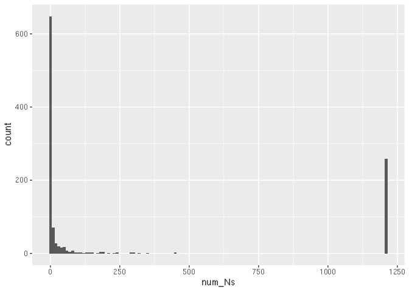

example_script_MKtest.Rmd
================
Janet Young

2025-02-14

# Load Janet’s MK functions

Also loads the Biostrings package.

``` r
source(here("scripts/MKfunctions.R"))

#### degapNucAln - function to remove columns that are entirely gap (or can use fractionOfSeqsWithGap to relax requirements of how many seqs have gap)
degapNucAln <- function(myAln, fractionOfSeqsWithGap=1) {
    maskedAln <- myAln %>% 
        DNAMultipleAlignment() %>% 
        maskGaps(min.fraction=fractionOfSeqsWithGap, 
                 min.block.width=1) %>% 
        DNAStringSet()
    return(maskedAln)
}
```

# Read in alignment

``` r
## original aln has 1325bp, 1117 seqs (1 simulans, 1116 melanogaster)
aln <- readBStringSet(here("data/mod_mdg4/modmdg4_alignment.fasta"))
aln
```

    ## BStringSet object of length 1117:
    ##        width seq                                            names               
    ##    [1]  1325 ATGGCGGACGACGAGCAATTCA...AGGGCAACACAGAGGCTCAAG Drosophila_melano...
    ##    [2]  1325 ATGGCGGACGACGAGCAATTCA...AGGGCAACACAGAGGCTCAAG Ref_3R
    ##    [3]  1325 ATGGCGGACGACGAGCAATTCA...AGGGCAACACAGAGGCTCAAG RAL-892_Chr3R
    ##    [4]  1325 ATGGCGGACGACGAGCAATTCA...AGGGCAACACAGAGGCTCAAG RAL-887_Chr3R
    ##    [5]  1325 ATGGCGGACGACGAGCAATTCA...AGGGCAACACAGAGGCTCAAG FR207_Chr3R
    ##    ...   ... ...
    ## [1113]  1325 NNNNNNNNNNNNNNNNNNNNNN...NNNNNNNNNNNNNNNNNNNNN USW_60_Chr3R
    ## [1114]  1325 NNNNNNNNNNNNNNNNNNNNNN...NNNNNNNNNNNNNNNNNNNNN USW_74_Chr3R
    ## [1115]  1325 NNNNNNNNNNNNNNNNNNNNNN...NNNNNNNNNNNNNNNNNNNNN USW_82_Chr3R
    ## [1116]  1325 NNNNNNNNNNNNNNNNNNNNNN...NNNNNNNNNNNNNNNNNNNNN USW_84_Chr3R
    ## [1117]  1325 NNNNNNNNNNNNNNNNNNNNNN...NNNNNNNNNNNNNNNNNNNNN ZS10_Chr3R

``` r
## Check names are unique - they are
# length(names(aln))
# length(unique(names(aln)))
```

first fix the gap positions. Remove any position where \>50% seqs have
gap. Now we have 1207bp aln (still 1117 seqs)

``` r
aln_degap <- degapNucAln(aln, fractionOfSeqsWithGap = 0.5)
aln_degap
```

    ## DNAStringSet object of length 1117:
    ##        width seq                                            names               
    ##    [1]  1207 ATGGCGGACGACGAGCAATTCA...AGGGCAACACAGAGGCTCAAG Drosophila_melano...
    ##    [2]  1207 ATGGCGGACGACGAGCAATTCA...AGGGCAACACAGAGGCTCAAG Ref_3R
    ##    [3]  1207 ATGGCGGACGACGAGCAATTCA...AGGGCAACACAGAGGCTCAAG RAL-892_Chr3R
    ##    [4]  1207 ATGGCGGACGACGAGCAATTCA...AGGGCAACACAGAGGCTCAAG RAL-887_Chr3R
    ##    [5]  1207 ATGGCGGACGACGAGCAATTCA...AGGGCAACACAGAGGCTCAAG FR207_Chr3R
    ##    ...   ... ...
    ## [1113]  1207 NNNNNNNNNNNNNNNNNNNNNN...NNNNNNNNNNNNNNNNNNNNN USW_60_Chr3R
    ## [1114]  1207 NNNNNNNNNNNNNNNNNNNNNN...NNNNNNNNNNNNNNNNNNNNN USW_74_Chr3R
    ## [1115]  1207 NNNNNNNNNNNNNNNNNNNNNN...NNNNNNNNNNNNNNNNNNNNN USW_82_Chr3R
    ## [1116]  1207 NNNNNNNNNNNNNNNNNNNNNN...NNNNNNNNNNNNNNNNNNNNN USW_84_Chr3R
    ## [1117]  1207 NNNNNNNNNNNNNNNNNNNNNN...NNNNNNNNNNNNNNNNNNNNN ZS10_Chr3R

Then trim to get rid of the last partial codon (end at 1206, not 1207,
to be a multiple of 3)

``` r
aln_degap_trim <- narrow(aln_degap, start=1, end=1206) %>% 
    BStringSet()
```

Get population names

``` r
sim_names <- grep("simulans", names(aln), value=TRUE)
mel_names <- grep("simulans", names(aln), value=TRUE, invert=TRUE)
```

Do the MK test. It works now! I still wasn’t handling the gap positions
correctly.

``` r
MK_results <- doMKtest(myAln=aln_degap_trim, 
                       pop1seqs=mel_names,
                       pop2seqs=sim_names,
                       quiet=FALSE, extraVerbose=FALSE)
```

    ##     splitting alignment into groups and tabulating nucleotides
    ##     looking at allele frequencies

    ## Warning: there are nucleotide positions where (in one population) every sequence has a gap or N. Positions:  580,581,582,583,584,585

    ##     inferring ancestors
    ##     starting output table
    ##     categorizing population 1 vs 2 fixed changes
    ##     categorizing polymorphisms
    ##         categorizing polymorphisms pop1
    ##         categorizing polymorphisms pop2
    ##     doing MK tests

# Results summary

Don’t get excited about the p-values: the NI (neutrality index) is 4.46,
indicating strong NEGATIVE selection (=purifying). There’s not as many
fixed non-synonymous changes as you’d expect (given the polymorphisms as
a proxy for neutrality).

The number of sequences tested is a bit misleading, because there are
quite a lot of seqs in this alignment that are all-N. We coule eliminate
those.

``` r
MK_results[["summary"]] %>% 
    select(-input) %>% 
    t() %>% 
    kable() %>% 
    kable_styling(full_width = FALSE)
```

<table class="table" style="width: auto !important; margin-left: auto; margin-right: auto;">
<thead>
<tr>
<th style="text-align:left;">
</th>
<th style="text-align:left;">
</th>
</tr>
</thead>
<tbody>
<tr>
<td style="text-align:left;">
num_seqs
</td>
<td style="text-align:left;">
1117
</td>
</tr>
<tr>
<td style="text-align:left;">
num_seqs_pop1
</td>
<td style="text-align:left;">
1116
</td>
</tr>
<tr>
<td style="text-align:left;">
num_seqs_pop2
</td>
<td style="text-align:left;">
1
</td>
</tr>
<tr>
<td style="text-align:left;">
num_seqs_outgroup
</td>
<td style="text-align:left;">
0
</td>
</tr>
<tr>
<td style="text-align:left;">
seqs_not_used
</td>
<td style="text-align:left;">
</td>
</tr>
<tr>
<td style="text-align:left;">
length_NT
</td>
<td style="text-align:left;">
1206
</td>
</tr>
<tr>
<td style="text-align:left;">
length_AA
</td>
<td style="text-align:left;">
402
</td>
</tr>
<tr>
<td style="text-align:left;">
region_start_coord_codons
</td>
<td style="text-align:left;">
1
</td>
</tr>
<tr>
<td style="text-align:left;">
region_end_coord_codons
</td>
<td style="text-align:left;">
402
</td>
</tr>
<tr>
<td style="text-align:left;">
filter_rare_alleles
</td>
<td style="text-align:left;">
FALSE
</td>
</tr>
<tr>
<td style="text-align:left;">
rare_allele_freq_threshold
</td>
<td style="text-align:left;">
0
</td>
</tr>
<tr>
<td style="text-align:left;">
parameter_combining_approach
</td>
<td style="text-align:left;">
conservative
</td>
</tr>
<tr>
<td style="text-align:left;">
first_pop1_seq
</td>
<td style="text-align:left;">
Drosophila_melanogaster
</td>
</tr>
<tr>
<td style="text-align:left;">
first_pop2_seq
</td>
<td style="text-align:left;">
Drosophila_simulans\_(reversed)
</td>
</tr>
<tr>
<td style="text-align:left;">
pop1_vs_pop2_chiSq_pVal
</td>
<td style="text-align:left;">
0.03648649
</td>
</tr>
<tr>
<td style="text-align:left;">
pop1_vs_pop2_FET_pVal
</td>
<td style="text-align:left;">
0.05928855
</td>
</tr>
<tr>
<td style="text-align:left;">
pop1_vs_pop2_Dn
</td>
<td style="text-align:left;">
2
</td>
</tr>
<tr>
<td style="text-align:left;">
pop1_vs_pop2_Ds
</td>
<td style="text-align:left;">
17
</td>
</tr>
<tr>
<td style="text-align:left;">
pop1_vs_pop2_Pn
</td>
<td style="text-align:left;">
42
</td>
</tr>
<tr>
<td style="text-align:left;">
pop1_vs_pop2_Ps
</td>
<td style="text-align:left;">
80
</td>
</tr>
<tr>
<td style="text-align:left;">
pop1_vs_pop2_NI
</td>
<td style="text-align:left;">
4.4625
</td>
</tr>
<tr>
<td style="text-align:left;">
pop1_vs_pop2_alpha
</td>
<td style="text-align:left;">
-3.4625
</td>
</tr>
<tr>
<td style="text-align:left;">
pop1_vs_pop2_result
</td>
<td style="text-align:left;">
not signif
</td>
</tr>
</tbody>
</table>

# Contingency table

``` r
showContingencyTable(MK_results[["summary"]]) %>% 
    t() %>% 
    kable() %>% 
    kable_styling(full_width = FALSE)
```

<table class="table" style="width: auto !important; margin-left: auto; margin-right: auto;">
<thead>
<tr>
<th style="text-align:left;">
</th>
<th style="text-align:right;">
synonymous
</th>
<th style="text-align:right;">
non-synonymous
</th>
</tr>
</thead>
<tbody>
<tr>
<td style="text-align:left;">
polymorphic
</td>
<td style="text-align:right;">
80
</td>
<td style="text-align:right;">
42
</td>
</tr>
<tr>
<td style="text-align:left;">
fixed
</td>
<td style="text-align:right;">
17
</td>
<td style="text-align:right;">
2
</td>
</tr>
</tbody>
</table>

# Eliminate N-heavy seqs

``` r
each_seq_split <- as.character(aln_degap_trim) %>% 
    strsplit(split="") 
each_seq_Ncounts <- sapply( each_seq_split, function(x) {
    sum(x=="N")
} )
aln_degap_trim_removeNseqs <- aln_degap_trim[ which(each_seq_Ncounts < 100) ]
```

Show histogram of num Ns per sequence

``` r
tibble(id=names(each_seq_Ncounts),
       num_Ns=each_seq_Ncounts) %>% 
    ggplot(aes(x=num_Ns)) +
    geom_histogram(binwidth=10)
```

<!-- -->

Run MK test on alignment without the very N-heavy sequences. Turns out
results are not changed very much (the Ns were treated as gaps, so
didn’t count as changes). A total of 5 polymorphisms (out of 112) went
away (probably seq errors or rare SNPs in the N-heavy sequences)

``` r
mel_names_v2 <- grep("simulans", names(aln_degap_trim_removeNseqs), value=TRUE, invert=TRUE)
MK_results_v2 <- doMKtest(myAln=aln_degap_trim_removeNseqs, 
                       pop1seqs=mel_names_v2,
                       pop2seqs=sim_names,
                       quiet=FALSE, extraVerbose=FALSE)
```

    ##     splitting alignment into groups and tabulating nucleotides
    ##     looking at allele frequencies

    ## Warning: there are nucleotide positions where (in one population) every sequence has a gap or N. Positions:  580,581,582,583,584,585

    ##     inferring ancestors
    ##     starting output table
    ##     categorizing population 1 vs 2 fixed changes
    ##     categorizing polymorphisms
    ##         categorizing polymorphisms pop1
    ##         categorizing polymorphisms pop2
    ##     doing MK tests

``` r
MK_results_v2[["summary"]] %>% 
    select(-input) %>% 
    t() %>% 
    kable() %>% 
    kable_styling(full_width = FALSE)
```

<table class="table" style="width: auto !important; margin-left: auto; margin-right: auto;">
<thead>
<tr>
<th style="text-align:left;">
</th>
<th style="text-align:left;">
</th>
</tr>
</thead>
<tbody>
<tr>
<td style="text-align:left;">
num_seqs
</td>
<td style="text-align:left;">
825
</td>
</tr>
<tr>
<td style="text-align:left;">
num_seqs_pop1
</td>
<td style="text-align:left;">
824
</td>
</tr>
<tr>
<td style="text-align:left;">
num_seqs_pop2
</td>
<td style="text-align:left;">
1
</td>
</tr>
<tr>
<td style="text-align:left;">
num_seqs_outgroup
</td>
<td style="text-align:left;">
0
</td>
</tr>
<tr>
<td style="text-align:left;">
seqs_not_used
</td>
<td style="text-align:left;">
</td>
</tr>
<tr>
<td style="text-align:left;">
length_NT
</td>
<td style="text-align:left;">
1206
</td>
</tr>
<tr>
<td style="text-align:left;">
length_AA
</td>
<td style="text-align:left;">
402
</td>
</tr>
<tr>
<td style="text-align:left;">
region_start_coord_codons
</td>
<td style="text-align:left;">
1
</td>
</tr>
<tr>
<td style="text-align:left;">
region_end_coord_codons
</td>
<td style="text-align:left;">
402
</td>
</tr>
<tr>
<td style="text-align:left;">
filter_rare_alleles
</td>
<td style="text-align:left;">
FALSE
</td>
</tr>
<tr>
<td style="text-align:left;">
rare_allele_freq_threshold
</td>
<td style="text-align:left;">
0
</td>
</tr>
<tr>
<td style="text-align:left;">
parameter_combining_approach
</td>
<td style="text-align:left;">
conservative
</td>
</tr>
<tr>
<td style="text-align:left;">
first_pop1_seq
</td>
<td style="text-align:left;">
Drosophila_melanogaster
</td>
</tr>
<tr>
<td style="text-align:left;">
first_pop2_seq
</td>
<td style="text-align:left;">
Drosophila_simulans\_(reversed)
</td>
</tr>
<tr>
<td style="text-align:left;">
pop1_vs_pop2_chiSq_pVal
</td>
<td style="text-align:left;">
0.05143376
</td>
</tr>
<tr>
<td style="text-align:left;">
pop1_vs_pop2_FET_pVal
</td>
<td style="text-align:left;">
0.05964219
</td>
</tr>
<tr>
<td style="text-align:left;">
pop1_vs_pop2_Dn
</td>
<td style="text-align:left;">
2
</td>
</tr>
<tr>
<td style="text-align:left;">
pop1_vs_pop2_Ds
</td>
<td style="text-align:left;">
17
</td>
</tr>
<tr>
<td style="text-align:left;">
pop1_vs_pop2_Pn
</td>
<td style="text-align:left;">
38
</td>
</tr>
<tr>
<td style="text-align:left;">
pop1_vs_pop2_Ps
</td>
<td style="text-align:left;">
79
</td>
</tr>
<tr>
<td style="text-align:left;">
pop1_vs_pop2_NI
</td>
<td style="text-align:left;">
4.088608
</td>
</tr>
<tr>
<td style="text-align:left;">
pop1_vs_pop2_alpha
</td>
<td style="text-align:left;">
-3.088608
</td>
</tr>
<tr>
<td style="text-align:left;">
pop1_vs_pop2_result
</td>
<td style="text-align:left;">
not signif
</td>
</tr>
</tbody>
</table>

``` r
showContingencyTable(MK_results_v2[["summary"]]) %>% 
    t() %>% 
    kable() %>% 
    kable_styling(full_width = FALSE)
```

<table class="table" style="width: auto !important; margin-left: auto; margin-right: auto;">
<thead>
<tr>
<th style="text-align:left;">
</th>
<th style="text-align:right;">
synonymous
</th>
<th style="text-align:right;">
non-synonymous
</th>
</tr>
</thead>
<tbody>
<tr>
<td style="text-align:left;">
polymorphic
</td>
<td style="text-align:right;">
79
</td>
<td style="text-align:right;">
38
</td>
</tr>
<tr>
<td style="text-align:left;">
fixed
</td>
<td style="text-align:right;">
17
</td>
<td style="text-align:right;">
2
</td>
</tr>
</tbody>
</table>

# Finished - show version info

``` r
sessionInfo()
```

    ## R version 4.4.0 (2024-04-24)
    ## Platform: x86_64-pc-linux-gnu
    ## Running under: Ubuntu 18.04.6 LTS
    ## 
    ## Matrix products: default
    ## BLAS/LAPACK: FlexiBLAS OPENBLAS;  LAPACK version 3.11.0
    ## 
    ## locale:
    ##  [1] LC_CTYPE=en_US.UTF-8       LC_NUMERIC=C              
    ##  [3] LC_TIME=en_US.UTF-8        LC_COLLATE=en_US.UTF-8    
    ##  [5] LC_MONETARY=en_US.UTF-8    LC_MESSAGES=en_US.UTF-8   
    ##  [7] LC_PAPER=en_US.UTF-8       LC_NAME=C                 
    ##  [9] LC_ADDRESS=C               LC_TELEPHONE=C            
    ## [11] LC_MEASUREMENT=en_US.UTF-8 LC_IDENTIFICATION=C       
    ## 
    ## time zone: America/Los_Angeles
    ## tzcode source: system (glibc)
    ## 
    ## attached base packages:
    ## [1] stats4    stats     graphics  grDevices utils     datasets  methods  
    ## [8] base     
    ## 
    ## other attached packages:
    ##  [1] Biostrings_2.72.0   GenomeInfoDb_1.40.0 XVector_0.44.0     
    ##  [4] IRanges_2.38.0      S4Vectors_0.42.0    BiocGenerics_0.50.0
    ##  [7] kableExtra_1.4.0    lubridate_1.9.4     forcats_1.0.0      
    ## [10] stringr_1.5.1       dplyr_1.1.4         purrr_1.0.4        
    ## [13] readr_2.1.5         tidyr_1.3.1         tibble_3.2.1       
    ## [16] ggplot2_3.5.1       tidyverse_2.0.0     here_1.0.1         
    ## 
    ## loaded via a namespace (and not attached):
    ##  [1] generics_0.1.3          xml2_1.3.6              stringi_1.8.4          
    ##  [4] hms_1.1.3               digest_0.6.35           magrittr_2.0.3         
    ##  [7] evaluate_0.23           grid_4.4.0              timechange_0.3.0       
    ## [10] fastmap_1.2.0           jsonlite_1.8.9          rprojroot_2.0.4        
    ## [13] httr_1.4.7              UCSC.utils_1.0.0        viridisLite_0.4.2      
    ## [16] scales_1.3.0            cli_3.6.3               crayon_1.5.2           
    ## [19] rlang_1.1.5             munsell_0.5.1           withr_3.0.2            
    ## [22] yaml_2.3.8              tools_4.4.0             tzdb_0.4.0             
    ## [25] colorspace_2.1-0        GenomeInfoDbData_1.2.12 vctrs_0.6.5            
    ## [28] R6_2.5.1                lifecycle_1.0.4         zlibbioc_1.50.0        
    ## [31] pkgconfig_2.0.3         pillar_1.10.1           gtable_0.3.5           
    ## [34] glue_1.8.0              systemfonts_1.1.0       highr_0.10             
    ## [37] xfun_0.44               tidyselect_1.2.1        rstudioapi_0.16.0      
    ## [40] knitr_1.46              farver_2.1.2            htmltools_0.5.8.1      
    ## [43] labeling_0.4.3          rmarkdown_2.26          svglite_2.1.3          
    ## [46] compiler_4.4.0
